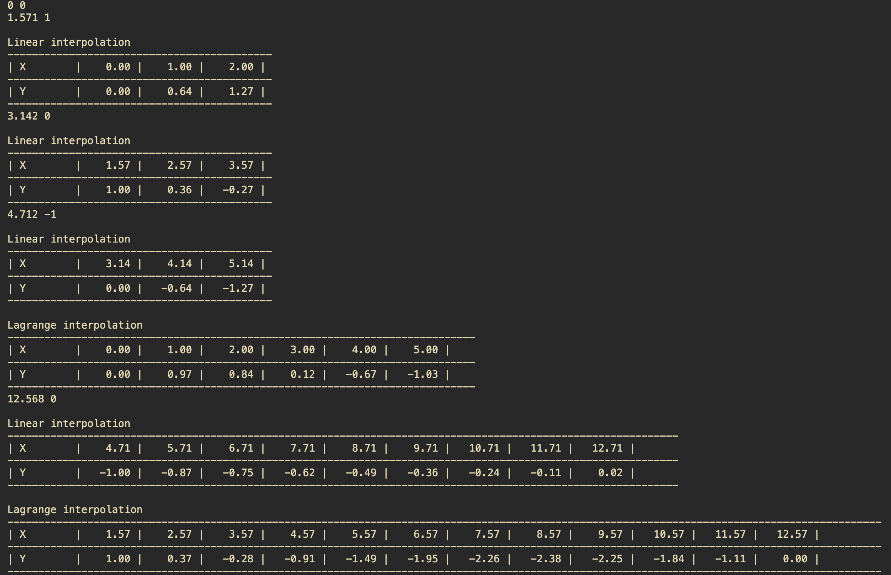

# Лабораторная работа №3
Андриянов Дмитрий P3312

## Структура проекта
- `bin/cli.ml` - точка входа в приложение
- `lib/compmath/interpolation.ml` - реализация алгоритмов интерполяции
- `lib/compmath/runner/runner.ml` - реализация запуска интерполяции в скользящем окне
- `lib/io/points_input.ml` - реализация ввода и парсинга точек
- `lib/io/output.ml` - вывод таблицы

## Архитектура приложения 


## Алгоритмы интерполяции
- Линейная интерполяция
- Интерполяция по Лагранжу

## CLI
- Метод указывается через аргумент `-m` (или `--method`). Доступные методы: `lagrange`, `linear`. 
- Шаг дискретизации указывается через аргумент `-s` (или `--step`). 
- Для метода интерполяции по Лагранжу можно указать количество точек, используемых для интерполяции (размер окна) через аргумент `-w` (или `--window`). По умолчанию используется 3 точки.
- Есть возможность запускать несколько методов интерполяции одновременно.

#### Примеры запуска
Интерполяция по Лагранжу с шагом дискретизации 0.1 и окном в 4 точки
```
dune exec FP3 -- -m lagrange -w 4 -s 0.1
```
Интерполяция линейным методом с шагом дискретизации 2
```
dune exec FP3 -- -m linear -s 2
```
Одновременный запуск двху методов интерполяции
```
dune exec FP3 -- -s 1.2 -m lagrange -w 4 -m linear -s 2
```

## Пример работы приложения

