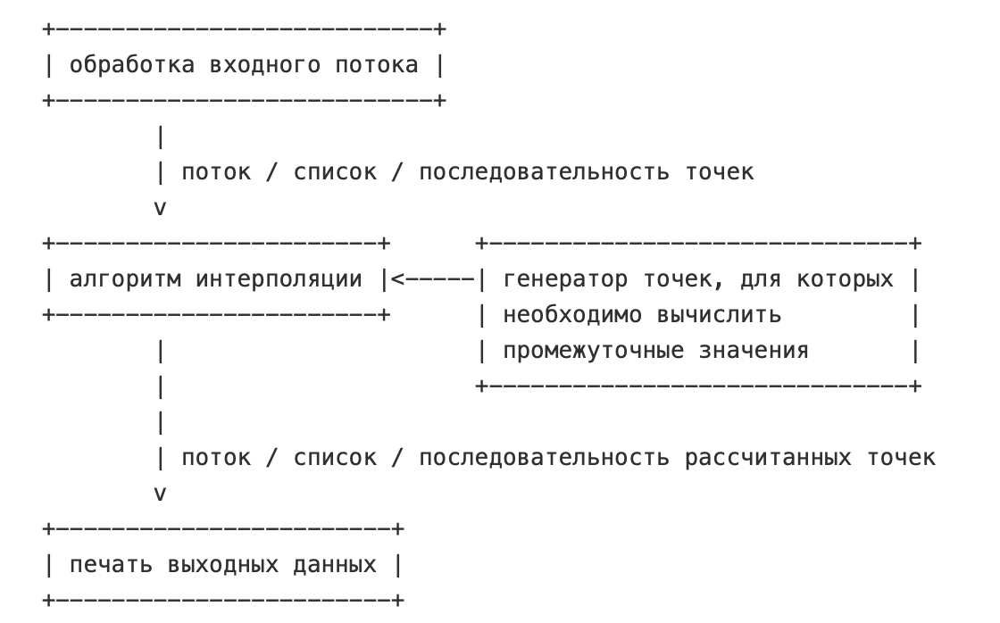

# Лабораторная работа №3
Андриянов Дмитрий P3312

## Структура проекта
- `bin/cli.ml` - точка входа в приложение
- `lib/compmath/interpolation.ml` - реализация алгоритмов интерполяции
- `lib/compmath/runner/runner.ml` - реализация запуска интерполяции в скользящем окне
- `lib/io/points_input.ml` - реализация ввода и парсинга точек
- `lib/io/output.ml` - вывод таблицы

## Архитектура приложения 


## Алгоритмы интерполяции
- Линейная интерполяция
- Интерполяция по Лагранжу

## CLI
- Метод указывается через аргумент `-m` (или `--method`). Доступные методы: `lagrange`, `linear`. 
- Шаг дискретизации указывается через аргумент `-s` (или `--step`). 
- Для метода интерполяции по Лагранжу можно указать количество точек, используемых для интерполяции (размер окна) через аргумент `-w` (или `--window`). По умолчанию используется 3 точки.
- Есть возможность запускать несколько методов интерполяции одновременно.

#### Примеры запуска
Интерполяция по Лагранжу с шагом дискретизации 0.1 и окном в 4 точки
```
dune exec FP3 -- -m lagrange -w 4 -s 0.1
```
Интерполяция линейным методом с шагом дискретизации 2
```
dune exec FP3 -- -m linear -s 2
```
Одновременный запуск двху методов интерполяции
```
dune exec FP3 -- --step 1.2 --method lagrange --window 4 --method linear
```

## Пример работы приложения
```
$ dune exec FP3 -- -m linear -s 1 -m lagrange -w 4
0 0                             
1.571 1

Linear interpolation
---------------------
| X       | Y       |
---------------------
|    0.00 |    0.00 |
|    1.00 |    0.64 |
---------------------
3.142 0

Linear interpolation
---------------------
| X       | Y       |
---------------------
|    1.57 |    1.00 |
|    2.57 |    0.36 |
---------------------
4.712 -1

Linear interpolation
---------------------
| X       | Y       |
---------------------
|    3.14 |    0.00 |
|    4.14 |   -0.64 |
---------------------

Lagrange interpolation
---------------------
| X       | Y       |
---------------------
|    3.14 |    0.00 |
|    4.14 |   -0.76 |
---------------------
12.568 0

Linear interpolation
---------------------
| X       | Y       |
---------------------
|    4.71 |   -1.00 |
|    5.71 |   -0.87 |
|    6.71 |   -0.75 |
|    7.71 |   -0.62 |
|    8.71 |   -0.49 |
|    9.71 |   -0.36 |
|   10.71 |   -0.24 |
|   11.71 |   -0.11 |
---------------------

Lagrange interpolation
---------------------
| X       | Y       |
---------------------
|    4.71 |   -1.00 |
|    5.71 |   -1.56 |
|    6.71 |   -2.00 |
|    7.71 |   -2.29 |
|    8.71 |   -2.38 |
|    9.71 |   -2.21 |
|   10.71 |   -1.76 |
|   11.71 |   -0.97 |
---------------------
...
```
